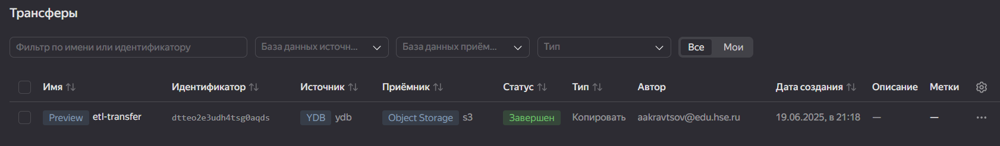
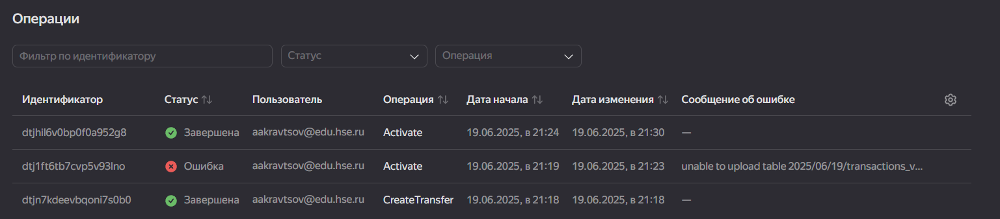
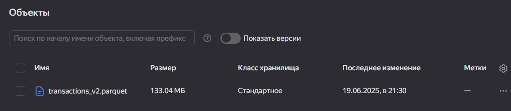
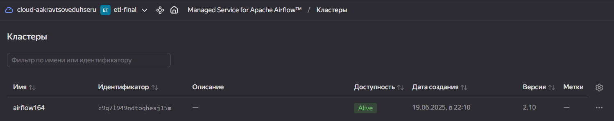
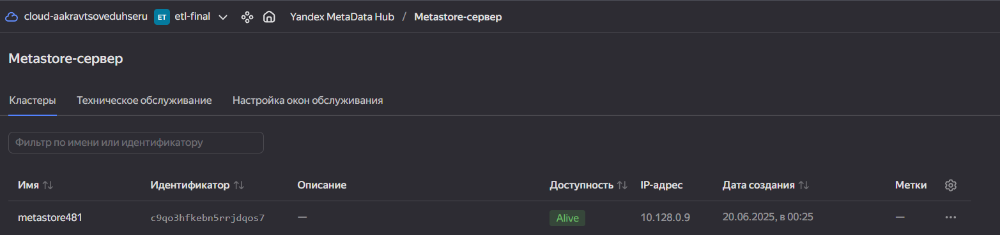
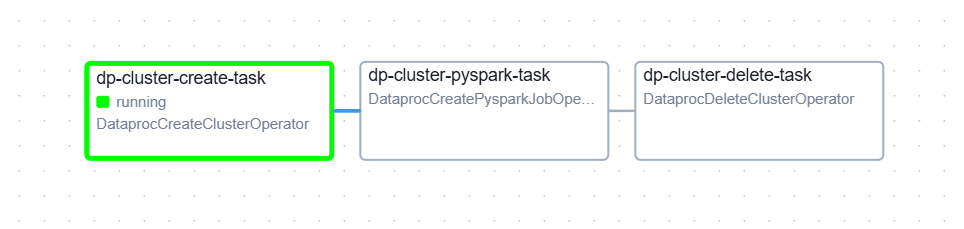

# Финальное задание по ETL (4 модуль)

## Задание 1

1. С помощью скрипта была создана база YDB:
```sql
CREATE TABLE transactions_v2 (
    id Serial
    ,step Int32
    ,type Text
    ,amount Double
    ,nameOrig Text
    ,oldbalanceOrig Double
    ,newbalanceOrig Double
    ,isFraud Int8
    ,isFlaggedFraud Int8
    ,PRIMARY KEY (id)
);
```

2. Далее [скриптом](task-1/add_id.py) на Python был подготовлен файл датасета для загрузки (в нем отсутствовал уникальный ключ, необходимо было его создать)

3. Затем через CLI подготовленный датасет был загружен в YDB:

```shell
yc ydb  \
--endpoint grpcs://ydb.serverless.yandexcloud.net:2135 \
--database /ru-central1/b1g5u0ua309ujjunpg99/etnonf89ebklrhn40b2v \
--sa-key-file authorized_key.json \
import file csv \
--path transactions_v2 \
--delimiter "," \
--skip-rows 1 \
--null-value "" \
--verbose \
Fraud.csv
```

4. Потом с помощью Data Transfer был настроен трансфер данных в Object Storage
(Ошибка возникла вследствие невыдачи прав сервисному аккаунту)




## Задание 2

1. Был создан кластер Airflow и сервер Metastore



2. Подготовлен DAG для автоматизации Dataproc - [тут](task-2/data_proc_dag.py)



3. Подготовлен скрипт для процессинга данных - [тут](task-2/process_data.py)